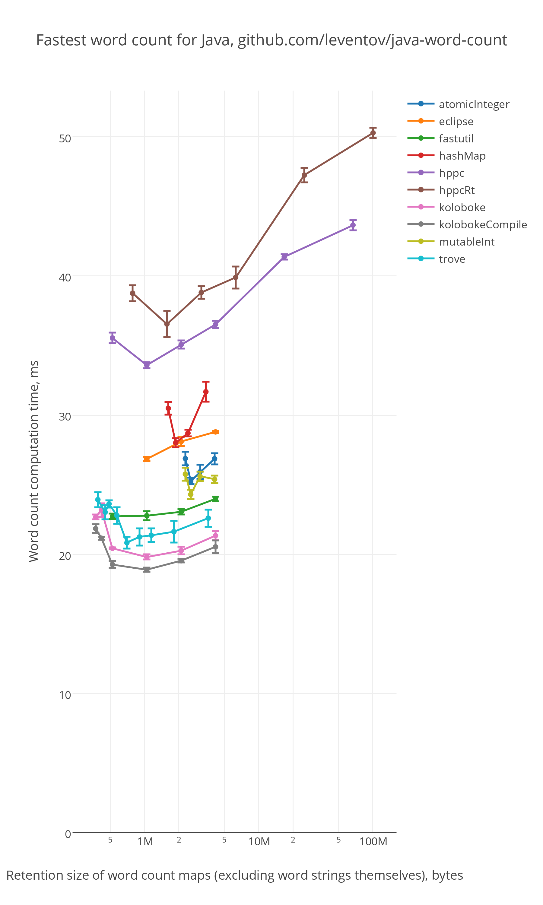

# Fastest Word Count in Java

For StackOverflow question [Most efficient way to increment a Map value in Java](
http://stackoverflow.com/a/25354509/648955).

Compared libraries:
 - JDK (`HashMap`)
 - [Eclipse Collections](http://www.eclipse.org/collections/)
 - [fastutil](http://fastutil.di.unimi.it/)
 - [HPPC](https://labs.carrotsearch.com/hppc.html)
 - [HPPC-RT](https://github.com/vsonnier/hppcrt)
 - [Koloboke implementation library](https://koloboke.com/implementation-library)
 - [Koloboke Compile](https://koloboke.com/compile)
 - [Trove](http://trove.starlight-systems.com/)

Build & run:
```
$ gradle jmh
```

Results on Intel i7-2600 @ 3.40GHz, Java 9 build 120: [jmh-results.txt](jmh-results.txt),
[**interactive results**](https://plot.ly/~leventov/2.embed?share_key=05drBbDBlC7P4CagzfiJPc),
static plot results: 